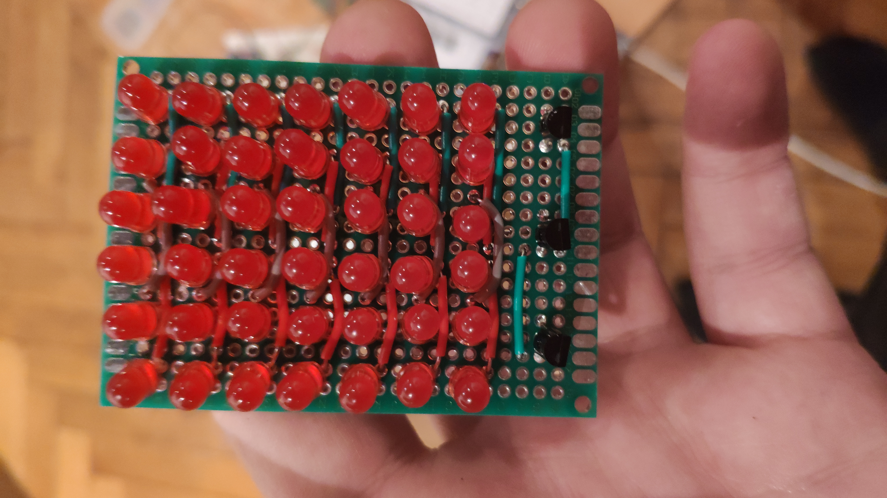

# Led Panel

This project is a DIY modular Led  display panel.

  

Each block is made of 6 column and 7 row of red leds.  
Leds are controlled 2 columns at a time (14 leds). 

The reason for this is that in the initial design, i wanted to control the whole panel with only 1 Arduino Nano, which one have only 12 Digital pins and 8 Analogic that can also be used as Digital ones. But as a block need 14 pins for the to control a 2 column set and 3 other pins to select the column set, a single Arduino Nano can only control 2 block.

# First version
The first working version used 1 Arduino Nano to control the columns electrical supply and 1 Raspberry PI 2 to control the individual leds of a column.  
As a Raspberry PI is much powerful than an Arduino Nano, it was better for the leds control. The Arduino was now only used to switch the columns power state, one after the other, in order and in loop.
The Arduino was power by USB, connected to the Raspberry PI.  
An additional wire was used between the Arduino and the Raspberry to force the synchronization of the 2 devices.  
With this version, the panel was able to have up to 6 blocks but only 4 were mades as it take at least 4 hours to make a block.  

# Second version
The second version was made right after i receive my new Arduino Mega, which have 54 Digital pins and 16 Analogic pins.  
As it had enough pins to handle itself the whole panel of 4 blocks, which means 28 pins, I move all the wire to the Arduino Mega Sensor Shield v2.0.  
Now that there is only 1 device to control the panel, there in no more syncronisation problems and the panel can be driven by serial or any other comunication moudule as the Arduino Mega had 28 digital pins left !  

# Random photos

  
3 blocks made the same day.

  
"Cables Management".

  
The whole 4 blocks panel from the back.

  
14 resistances for the 14 leds by set of 2 columns (on the left).  
12 resistances for the 4 blocks with 3 set of 2 columns each (on the center).

  
Litle "T" connector that allow to have 1 cable in and 1 out.